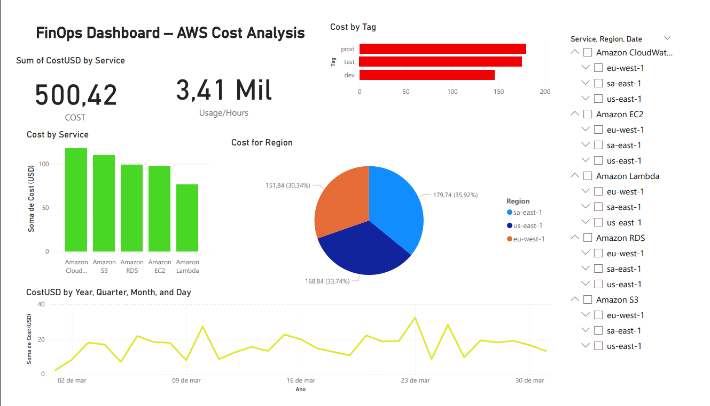

# FinOps Dashboard – AWS Cost Analysis with Power BI

📄 **Description**  
This dashboard was developed using Power BI to monitor and analyze AWS service costs, applying FinOps best practices. It provides clear visualizations by service, region, tags (dev, test, prod), and time periods, helping to optimize expenses and improve resource management in the cloud.

---

🎯 **Project Objectives**  
- Monitor and visualize AWS costs over time.  
- Identify services with the highest financial impact.  
- Analyze usage by region and environment tags.  
- Support cost optimization decisions based on FinOps practices.

---

📊 **Key Visualizations**

| Chart               | Description                                                    |
|--------------------|----------------------------------------------------------------|
| 📅 Cost by Date     | Daily cost trends (in USD) throughout the month.               |
| 🔧 Cost by Service  | Detailed breakdown of costs for each service (EC2, S3, Lambda, etc.). |
| 🌎 Cost by Region   | Distribution of costs across regions (sa-east-1, us-east-1, etc.). |
| 🏷 Cost by Tag      | Costs grouped by environment tags (dev, test, prod).           |
| 📊 Summary of Costs | Total spending and usage hours (key KPIs).                     |

---

🛠 **Tools Used**  
- **Power BI Desktop** – Dashboard development and visualizations  
- **Microsoft Excel** – Data preprocessing  
- **AWS Billing Export** – Simulated billing data  
- **FinOps Foundation Knowledge** – Principles applied to cost optimization  

---

🖼 **Dashboard Preview**  

---

📁 **Download the Power BI file**  
[Click here to download the `.pbix` file](FinOps%20Dashboard.pbix)

---

✍️ **Author**  
**Izadora Sobral**  
AWS Cloud Practitioner | FinOps Certified Practitioner  
[LinkedIn](https://www.linkedin.com/in/izadora-sobral)  
[GitHub](https://github.com/izadorasobral)
